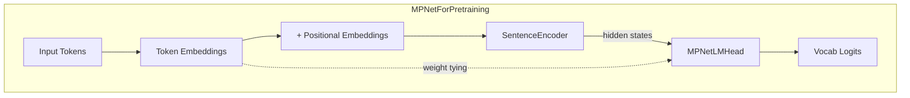
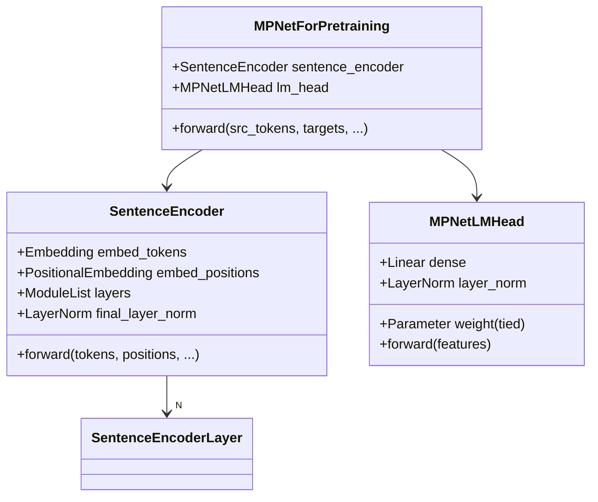
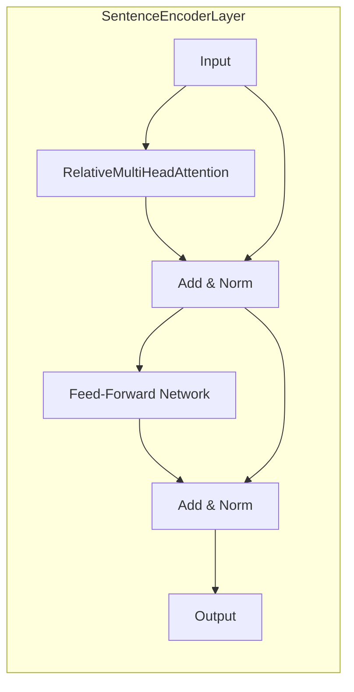
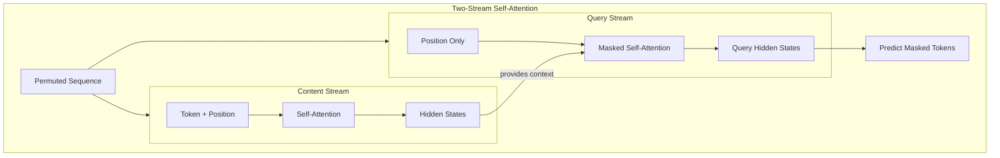
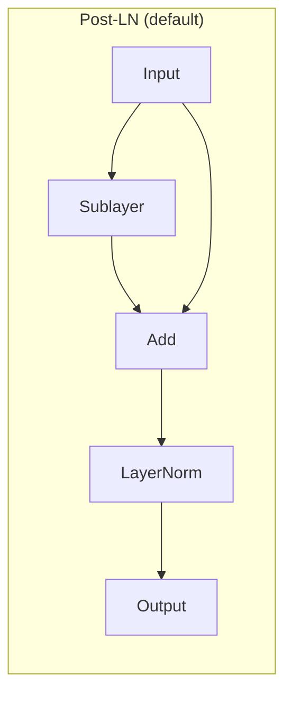
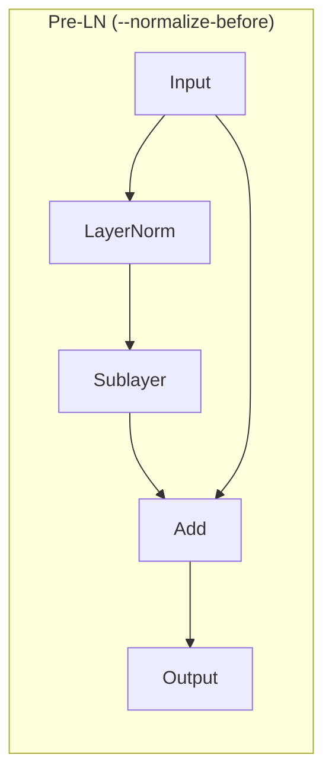

# Model Architecture

This document describes the MPNet architecture implemented in `annotated-mpnet`.

## Overview

MPNet (Masked and Permuted Pre-training for Language Understanding) utilizes a **Masked and Permuted Pre-training** objective. The architecture is based on the Transformer model.

The pretraining objective involves predicting original tokens based on a permuted sequence where a subset of tokens has been masked. The permutation helps in learning richer contextual representations compared to standard Masked Language Modeling (MLM).

## High-Level Architecture



## Core Components

### MPNetForPretraining

The main model class defined in `annotated_mpnet/modeling/mpnet_for_pretraining.py`. It encapsulates the encoder and the language modeling head.



### SentenceEncoder

The core of the model, this is a stack of Transformer encoder layers. It's responsible for generating contextualized representations of the input tokens. Found in `annotated_mpnet/transformer_modules/sentence_encoder.py`.

### SentenceEncoderLayer

Each layer within the `SentenceEncoder`:



**Components:**

- **RelativeMultiHeadAttention**: A multi-head self-attention mechanism that incorporates relative positional information, crucial for MPNet. Defined in `annotated_mpnet/transformer_modules/rel_multihead_attention.py`.
- **Explicit tensor layouts**: Shape transforms in attention and encoder paths use `einops.rearrange` to document and validate expected layouts (e.g., `(t b (h d)) -> (b h) t d`).
- Position-wise Feed-Forward Networks (FFN).
- Layer normalization.

### Positional Embeddings

The model uses positional embeddings to provide sequence order information. This implementation supports:

- **LearnedPositionalEmbedding**: Positional embeddings are learned during training.
- **SinusoidalPositionalEmbedding**: Fixed positional embeddings based on sine and cosine functions.

The choice is configurable via `pretrain-mpnet` arguments. These are found in `annotated_mpnet/transformer_modules/`.

### MPNetLMHead

A language modeling head placed on top of the `SentenceEncoder`'s output. It projects the contextual embeddings to the vocabulary space to predict the masked tokens. Defined in `annotated_mpnet/modeling/mpnet_for_pretraining.py`.

## Two-Stream Self-Attention

A key innovation of MPNet. This mechanism is implemented within the `MPNetForPretraining` forward pass.



**How it works:**

1. **Content stream**: Processes tokens with full self-attention (like standard BERT). Each position can attend to all other positions.

2. **Query stream**: Uses only positional information for the query. The predicted token cannot "see itself" - it can only attend to:
   - Content representations of non-target positions
   - Query representations of preceding positions (in permutation order)

This allows the model to learn bidirectional context without the predicted tokens "seeing themselves" in the non-permuted context.

```
Original:     [CLS] The  cat  sat [MASK] [SEP]
Permuted:     [CLS] sat  The [MASK] cat  [SEP]
                         ↓
Content:      Full bidirectional attention
Query:        Position-only query, masked self-attention
                         ↓
Prediction:   [MASK] → predicts "on" using context from all positions
```

## Normalization Strategy

The `--normalize-before` flag controls whether layer normalization is applied before or after sublayer operations:





Pre-LN can improve training stability for deeper models.
